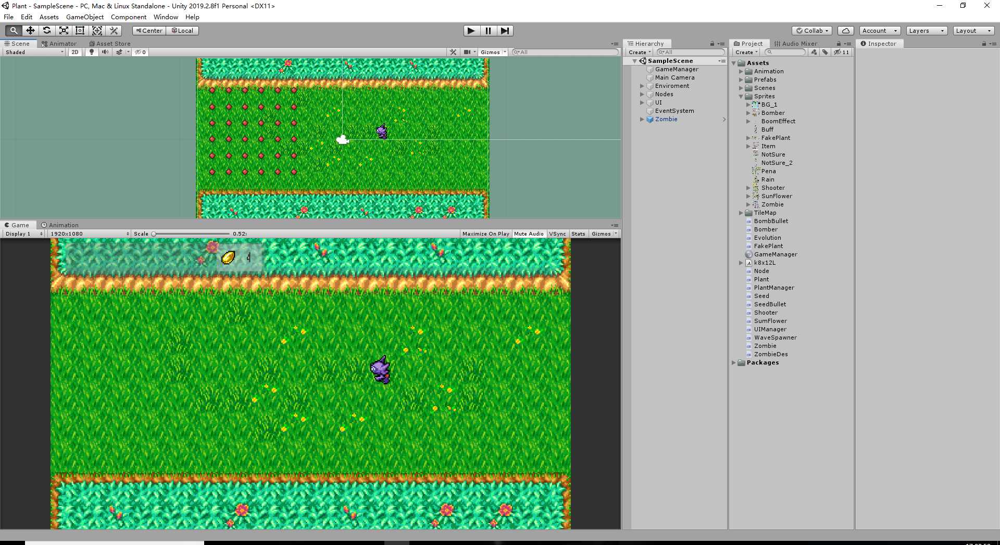
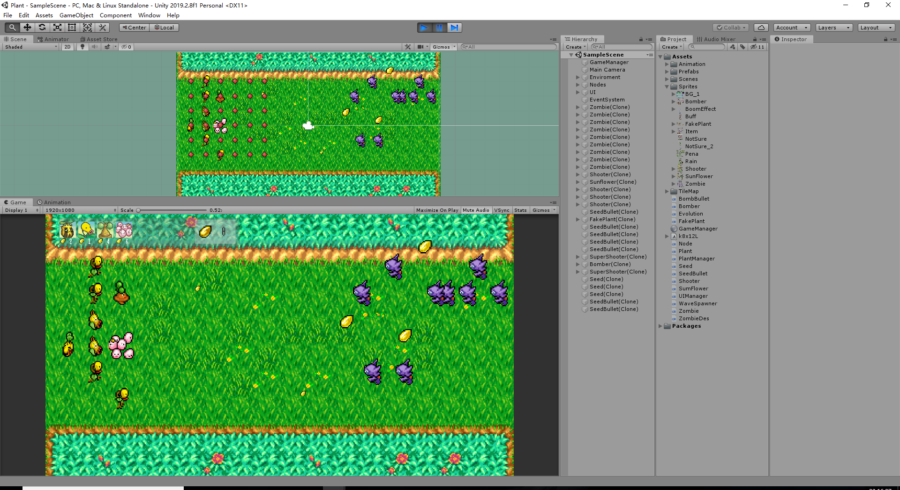

# OwnDemo
本人自学的一些小demo，实力不足还请见谅 
制作过程： 
1.在收集素材之后，设置2D环境，采用unity中的Timemap绘制大致的地图，由于制作采用2D，没有Y轴所有需要设置空物体规定好植物所放置的位置。然后规定相对的Tag和Layer 
2.在环境基本设置好之后，创建植物，设置层和标签还有碰撞器。并设置植物的Idle、Attack、Die、Hurt的动画，然后再在动画控制器上设置好对应的逻辑，以便在脚本中调用。同时创建一个Plant的脚本作为所有植物的泛型，之后生成的所有植物都继承于这个脚本或子脚本。 
3.设置种子的掉落并在GameManager脚本中实时更新种子的数量情况，进行鼠标拾取。 
4.敌人的生成，敌人由于只设置了一种，所以没有用一个泛类，敌人设置攻击的间隔、伤害、血量、速度等，同时也弄好它的动画逻辑。还要进行识别植物 
5.基本功能做好后，对所有脚本进行整合，测试那些地方存在Bug，进行修复。 
6.有意向做一个植物的进化（目前只弄了一个），创建一个进化的脚本继承于该植物，当击败多个敌人时进行进化。 

//[演示图片](图片相对路径)
- 

- 
